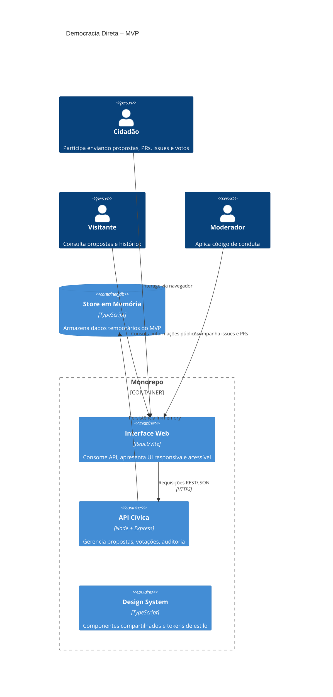

# Arquitetura do MVP

## Diagrama C4 – Visão de Contêiner

## Fluxo Principal – Proposta
1. Cidadão autentica-se via `/auth/login`, recebendo token (MVP: ID estático).
2. Cidadão cria proposta enviando título, resumo, README e tags.
3. API gera slug, branch `main` e commit inicial, registrando evento no `auditLog`.
4. Outros cidadãos forkeiam a proposta, criam commits e PRs, alimentando timeline.
5. Issues e votos são anexados ao histórico com auditoria.
6. Interface atualiza contadores e exibe Markdown renderizado.

## Observabilidade
- `auditLog` guarda actor, action, entity, metadata e timestamp.
- Logs podem ser exportados para SIEM no futuro.
- Estrutura preparada para introduzir OpenTelemetry (span wrappers nos controladores).

## Segurança
- Helmet adiciona cabeçalhos (CSP configurável em produção).
- Rate limiting planejado (ex.: `express-rate-limit`).
- Todos os endpoints validados com Zod.

## Escalabilidade Futura
- Substituir store por Postgres: basta adaptar funções em `store.ts` para usar um ORM.
- Filas BullMQ/RabbitMQ para e-mails e tarefas de auditoria pesada.
- Deploy sugerido: containers Docker (API, Web, Postgres, Redis) orquestrados via Kubernetes ou ECS, com IaC (Terraform) na pasta `infra/`.
